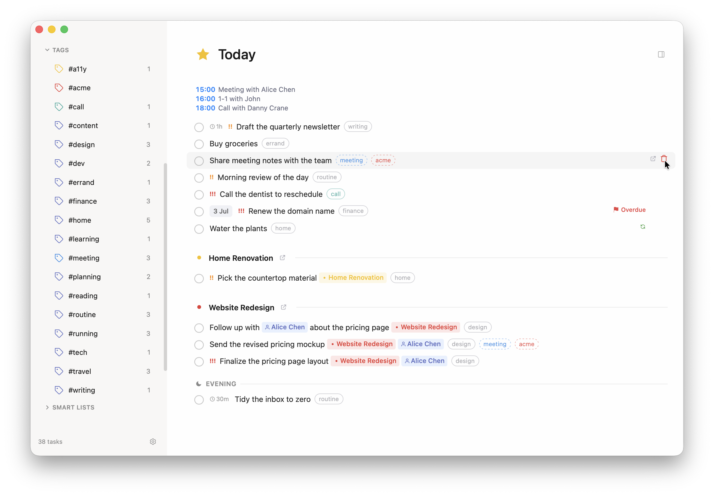

# Annado

A clean task manager for macOS that lives on (?) your Obsidian vault, or markdown files. No proprietary database, no lock-in, it's all based on your own files. Designed with Obsidian in mind, but also works as a stand-alone app or on your folder with markdown files. 


## The Idea

Your tasks stay as plain markdown in your Obsidian vault. Annado reads and writes standard checkbox syntax with inline metadata, giving you a polished native desktop UI while your data stays portable. Open the same vault in Obsidian and your tasks are right there.

Bilingual: supports Dutch and English for natural language date input.

## How It Works

Annado treats your Obsidian vault as its database. It scans every `.md` file for markdown checkboxes (`- [ ]` / `- [x]`) — or, if you set an import marker tag, only the checkboxes carrying that tag — parses inline annotations like `@when(...)`, `@due(...)`, and `[[WikiLinks]]`, and presents them in a task manager UI. Every edit you make in Annado is written straight back to the markdown files — no syncing, no export step, no sidecar database.

See it in action — capturing a task in an Obsidian daily note during a meeting, then editing it in Annado:


https://github.com/user-attachments/assets/343a7135-a676-4ebd-99f5-dae0626fe181


---

## Views

Annado has 12 views, each accessible from the sidebar or via keyboard shortcut:

| View | Shortcut | What's in it |
|---|---|---|
| **Inbox** | `Cmd+1` | Unscheduled tasks awaiting processing |
| **Today** | `Cmd+2` | Tasks scheduled for today |
| **Agenda** | `Cmd+3` | Day/week timeline with drag-to-schedule |
| **Upcoming** | `Cmd+4` | Tasks scheduled for future dates |
| **Anytime** | `Cmd+5` | Flexible-time tasks with no specific date |
| **Someday** | `Cmd+6` | Backlog and long-term tasks |
| **Logbook** | `Cmd+7` | Completed tasks history |
| **Recurring** | `Cmd+8` | Recurring task templates and instances |
| **Wrapped** | `Cmd+9` | Spotify Wrapped-style year-in-review |
| **Added Today** | `Cmd+0` | Tasks created today |
| **Review** | `Cmd+R` | Guided 5-step weekly review workflow |
| **Smart Lists** | sidebar | Custom-filtered task collections |


More screenshots of every view and panel: **[visual tour](docs/tour.md)**.

---

## Task Syntax

Annado reads and writes this inline markdown format:

```markdown
- [ ] Task title @when(tomorrow) @time(09:00) @duration(1h30m) [[Project]] !(1) #tag @due(2025-03-01)
    Notes go here, indented 4 spaces
    - [x] Checklist sub-item
```

| Field | Example | Description |
|---|---|---|
| `@when(...)` | `@when(tomorrow)` | Scheduled date |
| `@time(...)` | `@time(09:00)` | Scheduled time (used by Agenda) |
| `@duration(...)` | `@duration(1h30m)` | Estimated duration |
| `@due(...)` | `@due(2025-03-01)` | Deadline |
| `!(1-3)` | `!(1)` | Priority (1 = highest) |
| `#tag` | `#work` | Tag |
| `[[WikiLink]]` | `[[Project Name]]` | Project or person link |
| `@repeat(...)` | `@repeat(every 2 weeks)` | Recurrence rule (rolls forward on completion) |
| `@created(date)` | `@created(2025-02-14)` | Creation date |
| `@completed(date)` | `@completed(2025-02-16)` | Completion date |

Checklist sub-items (`- [ ] sub-task`) can be toggled directly in Annado — the change persists to the markdown file.

Markdown in a task title renders formatted — **bold**, *italic*, `code`, ~~strikethrough~~, `[[wikilinks]]`, and `[links](url)` (bare URLs are clickable too) — across the list, Agenda, Review, and the task detail. Click to edit and you get the plain markdown back.


---

## Task Format Compatibility

The syntax above is Annado's **native** format, but it isn't the only one Annado understands. If you already keep tasks in the [Obsidian Tasks](https://publish.obsidian.md/tasks/) emoji format or the [Dataview](https://blacksmithgu.github.io/obsidian-dataview/) inline-field format, Annado works with those too.

The rule is simple: **read any, write one.**

- **Read** — when Annado parses your vault it recognizes the markers of *all three* formats on every line, so an existing or mixed vault just works without conversion.
- **Write** — when Annado edits or creates a task it writes the **one** format you've chosen (Settings → General → *Task format*).

On first run Annado scans your vault, tallies which dialect your tasks predominantly use, and pre-selects it for you. You can change it any time. However, conversion is lazy, meaning each task keeps its existing markers until the next time you edit it.

### Field mapping

How each piece of task metadata is written in each format:

| Concept | Annado (native) | Obsidian Tasks | Dataview |
|---|---|---|---|
| Scheduled / when | `@when(d)` | `⏳ d` | `[scheduled:: d]` |
| Due / deadline | `@due(d)` | `📅 d` | `[due:: d]` |
| Created | `@created(d)` | `➕ d` | `[created:: d]` |
| Completed | `@completed(d)` | `✅ d` | `[completion:: d]` |
| Priority | `!(1)` `!(2)` `!(3)` | `⏫` `🔼` `🔽` | `[priority:: high/medium/low]` |
| Recurrence | `@repeat(rule)` | `🔁 rule` | `[repeat:: rule]` |
| Time of day | `@time(t)` | *(no equivalent)* | `[time:: t]` |
| Duration | `@duration(d)` | *(no equivalent)* | `[duration:: d]` |
| Tags | `#tag` | `#tag` | `#tag` |
| Project / person | `[[Link]]` | `[[Link]]` | `[[Link]]` |

On **read**, Annado is more generous than this table shows: it also maps Obsidian Tasks' `🛫` (start) and Dataview's `[start:: …]` onto *when*, and it accepts the two extra Tasks priority emoji (`🔺` highest, `⏬` lowest), clamping them to high/low since Annado has three priority levels rather than five.

### Priorities

Annado has **three** priority levels; Obsidian Tasks has five. The mapping is:

| Annado | Obsidian Tasks (read) | Obsidian Tasks (write) | Dataview |
|---|---|---|---|
| `!(1)` — high | `⏫` or `🔺` | `⏫` | `high` |
| `!(2)` — medium | `🔼` | `🔼` | `medium` |
| `!(3)` — low | `🔽` or `⏬` | `🔽` | `low` |

Reading clamps the two outer Tasks levels (`🔺` → high, `⏬` → low). Writing only ever emits the three middle emoji, so a `🔺`-priority task read from an Obsidian-Tasks vault becomes `⏫` if Annado rewrites that line. The other two formats are lossless — Annado and Dataview both map exactly to three levels.

### Limitations & things to know

- **Time and duration only exist in two of the three formats.** Obsidian Tasks has no concept of a time-of-day or an estimated duration. So when your chosen format is Obsidian Tasks, those two fields fall back to Annado's own `@time(...)` / `@duration(...)` markers rather than being dropped — the rest of the line is still pure Tasks emoji. Annado native and Dataview both express them directly.
- **Recurrence is partly modeled, partly preserved.** Annado fully understands the interval subset — `every [N] day|week|month|year[s]`, optionally with ` when done` (next occurrence counts from the completion date instead of the scheduled date). It reads, writes, and rolls these forward on completion in any format. Richer Obsidian Tasks rules — `every weekday`, `every week on Monday`, `every month on the 3rd Thursday`, ordinal monthly/yearly — are **round-trip-preserved**: Annado keeps the rule string verbatim and writes it back unchanged (so the Obsidian Tasks plugin still advances it), but Annado itself won't compute their next occurrence and shows them read-only in its recurrence editor.
- **Recurrence is roll-forward, not pre-generated.** Completing a recurring task writes the *next* single occurrence and marks the current one done. Annado does not pre-generate a long list of future instances, so Upcoming shows the next occurrence rather than every future one. (This replaces the old template-based engine and its `@recurring(id)` marker — see the migration tool in Settings if you have a legacy vault.)
- **Unknown markers are never clobbered.** Any marker Annado doesn't recognize — a plugin field it doesn't model, a stray emoji — is left untouched on the line when Annado rewrites it.
- **The format setting is vault-wide.** It's a single choice per vault, not per-file or per-task.
- **Tags and wikilinks are identical across all three formats** — `#tag` and `[[Link]]` are plain Obsidian syntax, so they need no translation and are never rewritten.

---

## Scheduling

### Natural Language Dates

Type dates in plain language in any date picker. Both English and Dutch are supported:

| Category | English | Dutch |
|---|---|---|
| Keywords | `today`, `tonight`, `tomorrow`, `anytime`, `someday` | `vandaag`, `vanavond`, `morgen`, `overmorgen`, `altijd`, `ooit` |
| Relative | `this weekend`, `next weekend`, `next week`, `next month`, `end of week`, `end of month` | `dit weekend`, `volgend weekend`, `volgende week`, `volgende maand`, `eind van de maand` |
| Weekdays | `friday`, `fri`, `next monday` | `vrijdag`, `vr`, `volgende maandag` |
| Offsets | `in 3 days`, `in three weeks`, `in a week` | `over 3 dagen`, `over twee weken`, `over een week` |
| Explicit | `2026-12-25`, `25/12`, `feb 14`, `march 15 2027` | `25-12`, `22 mei`, `15 maart 2027` |

Offsets accept digits or spelled-out numbers up to twelve. Partial dates roll forward: typing `22 mei` in June resolves to next year's May 22. While typing, the picker shows ranked suggestions, and quick-select chips (Today, Tomorrow, This Weekend, Next Week) are always one click away.


### Date Hints in Titles

Annado also spots dates in the task titles you type. Write "Call Lena friday" in Quick Add and a banner offers to schedule the task for Friday — accept it and the date is set with the title cleaned up to "Call Lena". Prefix the phrase with `by`, `due`, `before` (or `voor` / `uiterlijk` in Dutch) and it's offered as a deadline instead: "Submit taxes by tomorrow" → deadline tomorrow, title "Submit taxes".


### When Values

The `@when(...)` field accepts:
- `inbox` — no schedule (appears in Inbox)
- `today` — scheduled for today
- `evening` — this evening
- `tomorrow` — scheduled for tomorrow
- `anytime` — flexible timing
- `someday` — backlog
- `YYYY-MM-DD` — specific date

### Deadlines

Tasks can have a separate deadline (`@due(...)`), independent of their scheduled date. Deadlines show countdown labels and urgency color-coding in the UI.

---

## Projects, People & Tags

### Projects

- Each `.md` file in your configured projects folder becomes a project.
- Nest folders to create hierarchy — child projects inherit the parent folder's color.
- Assign tasks via `[[Project Name]]` wiki-links.
- Project metadata (description, deadline, start date, ranking, related people, milestones) can be set in the file's YAML frontmatter.
- Projects are color-coded and drag-to-reorder in the sidebar.
- The sidebar shows task counts per project (toggleable in Settings).


### Areas

If you prefer folder-based grouping over explicit links, configure an **Areas pattern** (Settings → Folder Paths). Tasks without a `[[Project]]` link are then grouped by the matching folder they live in.

### People

- Each `.md` file in your configured persons folder becomes a contact.
- Link tasks to people via `[[Person Name]]` wiki-links.
- Person metadata (organisation, relationship, languages) is read from YAML frontmatter.


### Tags

- Add tags with `#tagname` in the task line, or manage a task's tags in the tag editor — type and press **Return** to add an existing tag or create a new one on the spot.
- Tags are color-coded (colors persist per tag, customizable by right-clicking).
- **Case-insensitive** — `#research` and `#Research` are the same tag; counts merge and searching either finds both.
- **Nested & hyphenated** — Obsidian-style `#parent/child` tags group under a breadcrumb in the sidebar, and hyphenated names like `#paper-for-conference` stay intact.
- Filter the current view by clicking a tag in the sidebar.
- **Inherit tags from notes** (opt-in — Settings → General): show a note's frontmatter `tags:` on every task in that note. Inherited pills use the tag's own color with a dashed border (your own tags stay solid), filter and count like normal tags, and are never written to the task line. Override per note with the `annado_inherit_tags: true` / `false` property. All frontmatter forms work — YAML lists, inline arrays, comma strings, with or without `#`.


### Priority

Three levels: `!(1)` high · `!(2)` medium · `!(3)` low. Filter or create Smart Lists based on priority.

---

## Smart Lists

Smart Lists are saved custom filters, accessible from the sidebar with a custom emoji icon. Each Smart List can filter by any combination of:

- **View**: Inbox, Today, Upcoming, Anytime, or Someday
- **Priority**: High, Medium, or Low
- **Deadline**: has a deadline / no deadline
- **Due within**: N days / weeks / months
- **Projects**: one or more specific projects
- **Person**: a specific contact
- **Tag**: a specific tag
- **Age**: older than N days

Create a Smart List via the `+` button in the sidebar Smart Lists section, or by pressing `Cmd+Shift+L`. Right-click a Smart List to edit or delete it.


---

## Recurring Tasks

A recurring task is an ordinary task with a `@repeat(...)` rule — no separate template files. Completing it writes the *next* occurrence and marks the current one done, so it rolls forward instead of pre-generating a long list of future instances. Two modes:

- **Fixed interval** — every N days / weeks / months / years (e.g. `@repeat(every 2 weeks)`)
- **After completion** — the next occurrence is scheduled N days after you mark it done (`… when done`)

The **Recurring** view (`Cmd+8`) collects your recurring tasks. Create or edit a recurrence with `Cmd+Shift+R`, the `+` button in the Recurring view, or from a task's detail. Richer Obsidian-Tasks rules that Annado doesn't compute are preserved verbatim and shown read-only (see [Task Format Compatibility](#task-format-compatibility)).

Upgrading from the old template-based engine? **Settings** has a migration tool that detects legacy `@recurring(id)` templates and converts them safely — preview (dry-run), back up your vault, then apply.


---

## Agenda

The Agenda view (`Cmd+3`) is a time-blocking timeline:


- **Day and Week** subviews (toggle in the top bar)
- **Current-time line** shows where you are in the day
- **Drag tasks** onto a time slot to schedule them at a specific time
- **Resize task blocks** to adjust duration
- **Unscheduled tasks panel** on the side — drag into the timeline or use Auto Schedule
- **Auto-scheduling**: places unscheduled tasks into available gaps respecting your work schedule, breaks, and blocking calendar events
- **Reschedule suggestions**: when you drag a task off its slot, Annado suggests the next 3 available slots across upcoming days
- **Calendar events** overlay inline (all-day events at the top, timed events in the timeline)
- **Calendar blocking**: mark specific calendars as "blocks auto-scheduling" in Settings so events are treated as busy time

Set a task's time with `@time(HH:MM)` or by dragging it to a slot. Set duration with `@duration(...)` or by resizing the block.

---

## Review

The Review workflow (`Cmd+R`) walks you through a structured 5-step weekly review:

1. **Process your inbox** — review and schedule unscheduled tasks
2. **Handle overdue tasks** — reschedule or complete tasks past their scheduled date
3. **Review stalled tasks** — tasks that haven't moved in a while
4. **Quiet projects** — projects with no recent activity
5. **Coming up next week** — a preview of what's scheduled next week

Each step shows a progress bar and task cards with inline actions (schedule, complete, delete, open in Obsidian). Use number keys `1–4` for quick actions within each step.


---

## Wrapped

The Wrapped view (`Cmd+9`) is a Spotify Wrapped-style year-in-review. Select a time period (week, month, or year) and step through a deck of animated slides (which ones appear depends on your data):


1. **Intro** — total completions with creation and completion rate stats
2. **Big Number** — your headline completion count with count-up animation
3. **Heatmap** — completion activity over time, GitHub-style
4. **Bar Chart** — completions by time period (week/month)
5. **Area Distribution** — how your work spread across folder areas
6. **Project Focus** — top projects by completions with momentum indicators
7. **Task Age** — how long it took you to complete tasks (buckets)
8. **Comparison** — this period vs the previous one
9. **Contrast** — longest task to complete vs oldest open task
10. **Personality** — your productivity personality type with supporting stats
11. **Look Ahead** — upcoming open tasks and key deadlines
12. **Outro** — summary with top projects

---

## Quick Add & Quick Find

### Quick Add (`Cmd+N`)

Rapid task capture from anywhere in the app. Respects the current view context (e.g., opening Quick Add in a project view pre-fills that project). Supports all inline annotations and date hints in titles.

**System-wide**: `Cmd+Shift+Space` opens Quick Add even when Annado is in the background.

**Where new tasks land**: tasks created in Annado are appended to today's daily note, which is created automatically (with frontmatter and a `## Tasks` heading) if it doesn't exist yet. In an Obsidian vault, Annado reads your existing Daily Notes plugin settings to find the right folder and filename format; otherwise the folder and format configured in Settings → Folder Paths are used.


### Quick Find (`Cmd+F` or type any letter)

Universal search across tasks, projects, people, views, and tags. Shows recent items when empty. Results update as you type.


---

## Bulk Operations

Select multiple tasks with `Cmd+Click`, `Shift+Click` for a range, or `Cmd+A` to grab every visible task — the count on the left doubles as a **Select all / Deselect all** toggle. When more than one is selected, a bulk-action toolbar appears at the bottom of the list:

- **When** — reschedule all selected tasks (full date picker)
- **Project** — reassign all selected tasks
- **Deadline** — set a deadline on all selected tasks
- **Complete** all selected tasks
- **Delete** all selected tasks — fully undoable with **⌘Z** (one undo restores the whole batch to its original positions)


### Delete & undo

Hover the right edge of any task row for a delete button, or use Delete on the expanded card. Deletion is fully undoable — **⌘Z** restores the task (and its notes, checklist, and position) byte-identically in the markdown file. The optional "Confirm before deleting" prompt (Settings → General) is honored.



---

## Side Panel

Open a second, independent task view alongside the main view with `Cmd+\`. The side panel:

- Has its own view selection, filtering, and task selection state
- Supports drag-and-drop **from** and **to** the main panel
- Is resizable by dragging the divider
- Remembers its width across sessions


---

## Obsidian Integration

- **Jump to source**: click the Obsidian icon on any expanded task to open the source `.md` file at the exact line number in Obsidian
- **Live sync**: file changes made in Obsidian are reflected in Annado in real time (file watcher)
- **Wiki-links**: `[[Project]]` and `[[Person]]` links are parsed and rendered as navigation links in the UI
- **Vault detection**: Annado detects whether the folder is an Obsidian vault (`.obsidian/` present) and adapts — e.g., daily-note settings are read from Obsidian's own config
- **Open In / Open With**: open any task's (or project/person's) backing `.md` file in the app of your choice — from the task row's right-edge hover zone, the expanded card, a project/person's metadata pane, the agenda and review, or the right-click menu of sidebar projects and persons ("Open in <default>" + an "Open with…" submenu). Editors that support it (Sublime Text, VS Code, Cursor, Zed) open at the task's exact line. Configure it all in **Settings → General → Open In**: reorder the openers, hide ones you don't use, pick a default, and add custom command-line openers with `{file}` / `{dir}` / `{line}` placeholders. In an Obsidian vault, Obsidian is the default automatically.
- **Your task format**: Annado reads Obsidian Tasks and Dataview tasks alongside its own, and writes whichever you pick — see [Task Format Compatibility](#task-format-compatibility)

---

## Deep Linking

Annado registers the `annado://` URL scheme for external capture from Shortcuts, Alfred, shell scripts, etc.:

```
annado://quickadd?title=Buy+groceries&notes=Milk,+eggs&when=tomorrow&project=Shopping
```

Supported parameters: `title`, `notes`, `when`, `project`.

---

## Keyboard Shortcuts

| Shortcut | Action |
|---|---|
| `Cmd+N` | Quick Add |
| `Cmd+F` | Quick Find |
| `Cmd+S` | Open When date picker |
| `Cmd+D` | Open Deadline date picker |
| `Cmd+T` | Schedule to Today |
| `Cmd+K` | Toggle complete |
| `Cmd+Backspace` | Delete task |
| `Cmd+Z` | Undo (e.g. restore a just-deleted task) |
| `Cmd+Shift+M` | Move to Project |
| `Cmd+Shift+L` | New Smart List |
| `Cmd+Shift+R` | New recurring task |
| `Cmd+\` | Toggle side panel |
| `Cmd+1` – `Cmd+6` | Switch view: Inbox → Someday |
| `Cmd+7` | Logbook |
| `Cmd+8` | Recurring |
| `Cmd+9` | Wrapped |
| `Cmd+0` | Added Today |
| `Cmd+R` | Review |
| `Cmd+,` | Open Settings |
| `Cmd+Shift+Space` | Global Quick Add (system-wide) |
| `Cmd+Shift+A` | Show/focus app (system-wide) |
| `Ctrl+J` / `Ctrl+K` | Navigate tasks down / up |
| `Enter` | Expand/collapse selected task |
| `Escape` | Close modal / deselect |
| Type any letter | Opens Quick Find with that character |

Shortcuts marked *system-wide* work even when Annado is in the background. All customisable shortcuts can be rebound in **Settings → Keyboard Shortcuts**.

---

## Notifications & Menu Bar

Annado can remind you about deadlines without you having the app in front of you:

- **Morning of deadline** — a reminder on the day itself (default 09:00)
- **Day before deadline** — a heads-up the evening before (default 18:00)
- **Overdue daily** — a daily nudge listing overdue tasks (default 08:00)
- **Launch banner** — a summary notification when the app starts

All notification types can be toggled individually, each with its own time, plus a master on/off switch and a test button (**Settings → Notifications**).

There's also a **menu bar icon** (toggleable) with a quick task panel, and two system-wide shortcuts: `Cmd+Shift+Space` for Quick Add and `Cmd+Shift+A` to show/focus the app.

The menu-bar panel doubles as a capture box: type a title to add a task to today, or **start the line with `-`** to jot a plain note into today's daily note instead of a task — a one-way entry that lands in the note but never shows up as a task in Annado.


---

## Excluded Files

Not every file in your vault should be scanned for tasks. There are two ways to exclude files:

**From Settings** (`Cmd+,`) → **Excluded Files & Folders**

Add paths relative to the vault root. A trailing `/` excludes an entire directory; otherwise it targets a single file.

```
Archive/                     ← skip everything under Archive
Templates/Meeting.md         ← skip one specific file
```

**Via frontmatter**

Any file with `annado_exclude: true` in its YAML frontmatter is silently skipped during scanning. Annado writes this automatically when you exclude a file through the UI, but you can also add it by hand:

```yaml
---
annado_exclude: true
---
```

---

## Settings

Open Settings with `Cmd+,`. Five tabs:

### General

| Section | What you can configure |
|---|---|
| **Vault** | View or change the active vault location |
| **Appearance** | Theme — Light, Dark, or System; accent color |
| **Open In** | The openers behind a file's "open in" button/menu: reorder, hide, pick a default, and add custom command-line openers (`{file}`/`{dir}`/`{line}`). Editors like Sublime/VS Code/Cursor/Zed open at the task's line; in Obsidian vaults Obsidian is the default |
| **Import marker** | Off = import every checkbox; on = only import checkboxes carrying your marker tag (e.g. `#task`), ignoring other checkboxes |
| **Inherit tags from notes** | Show a note's frontmatter `tags:` on its tasks (display-only; override per note with `annado_inherit_tags`) |
| **Tasks** | Default task duration (15m–2h); confirm-before-delete toggle |
| **Sidebar Counts** | Show/hide task counts per view and per project section |
| **Excluded Files & Folders** | Manage the path exclusion list (see above) |
| **Folder Paths** | Project / person / areas folder patterns; daily notes folder and filename format |


### Calendar

| Section | What you can configure |
|---|---|
| **Week** | Week start day (Monday or Sunday); show/hide weekends in Agenda |
| **Calendar** | Toggle macOS Calendar event display; per-calendar blocking toggle |
| **Schedule** | Work days (per day on/off), start/end times, and named breaks with per-weekday selection |

The work schedule drives Agenda auto-scheduling — tasks are only placed in open work hours, avoiding breaks and blocked calendar events.

### Shortcuts

View all fixed shortcuts and remap any customisable shortcut. Click a shortcut row, press your new key combination, and save.

### Notifications

| Section | What you can configure |
|---|---|
| **Menu bar** | Show/hide the menu bar (tray) icon |
| **Notifications** | Master on/off; morning-of, day-before, and overdue-daily reminders, each with its own time |
| **Launch banner** | Summary notification on app start |
| **Test** | Send a test notification |

### About

App info: version, links to the GitHub repository, issue tracker, and the visual tour.

---

## Vault Structure

Below is an example layout that works out of the box with the default folder patterns:

```
My Vault/
├── Projects/
│   ├── Work/
│   │   ├── Website Redesign.md    ← project with sub-folder hierarchy
│   │   └── Q1 Planning.md
│   └── Personal/
│       └── Home Renovation.md
├── Persons/
│   ├── Alice.md                   ← contact, frontmatter for metadata
│   └── Bob.md
├── Tasks.md                       ← tasks can live in any .md file
├── Daily Notes/
│   └── 2025-02-16.md              ← tasks here too (recurring ones just carry @repeat)
└── ...
```

Tasks can live in *any* markdown file in the vault — Annado scans them all (minus exclusions). The folder patterns are substring matches, so `Projects` matches `Projects/`, `01. Projects/`, `Work/Projects/`, etc.

---

## Getting Started

### 1. Install and run

```
npm install
npm run tauri dev
```

### 2. Select your vault

On first launch Annado will ask you to pick a folder — point it at your Obsidian vault root. This is the only required setup step.

### 3. Configure folder paths (optional)

Annado looks for projects, people, and recurring task templates by matching folder names. Customise these patterns in **Settings** (`Cmd+,`) → **Folder Paths**.

| Setting | Default | What it does |
|---|---|---|
| **Projects pattern** | `Projects` | Folders whose path contains this string are scanned for project files |
| **Persons pattern** | `Persons` | Same idea for contacts |
| **Areas pattern** | `Areas` | Folder-based grouping for tasks without a `[[Project]]` link |
| **Daily notes folder / format** | `00. Daily Notes` / `YYYY/MM-MMMM/YYYY-MM-DD` | Where new tasks are written (ignored in Obsidian vaults with the Daily Notes plugin configured — its settings win) |

---

## Tech Stack

- **Frontend**: React 19, TypeScript, Tailwind CSS 4, Zustand, dnd-kit
- **Desktop**: Tauri 2 (Rust-based framework)
- **Backend**: Rust — file parsing, vault watching, macOS Calendar integration, recurring task generation

## Building

```
npm run tauri build
```
