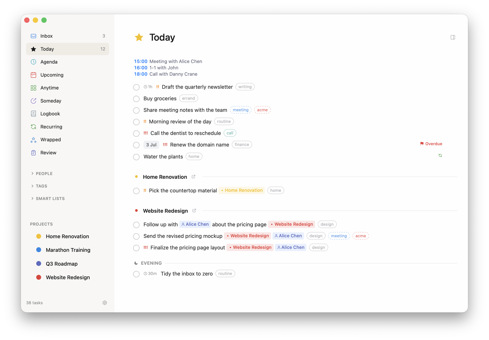
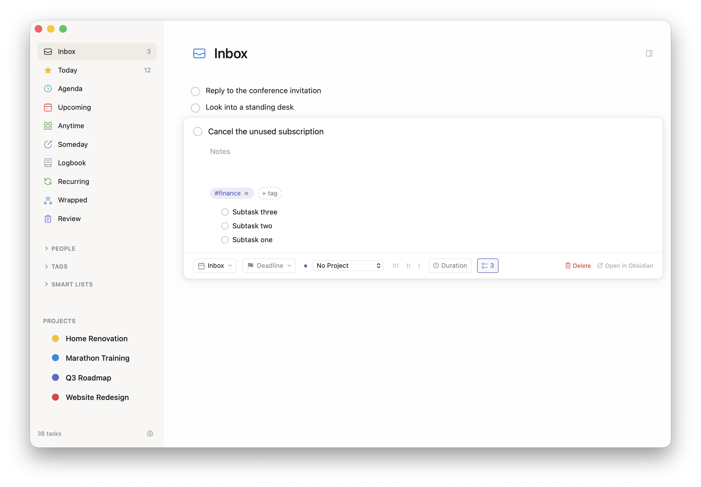
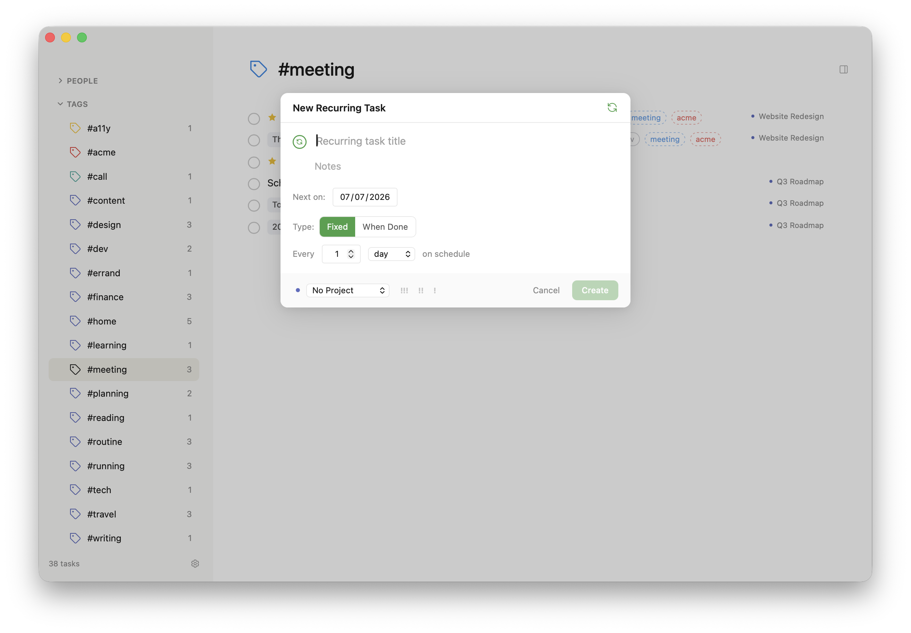
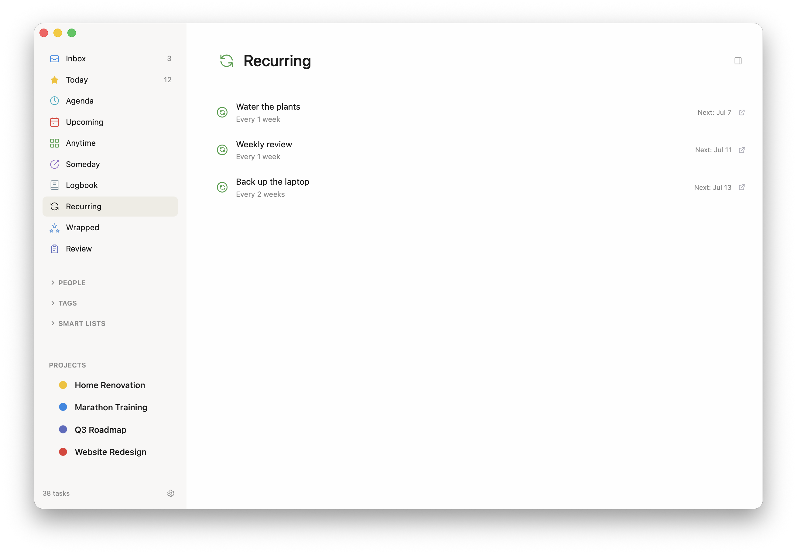
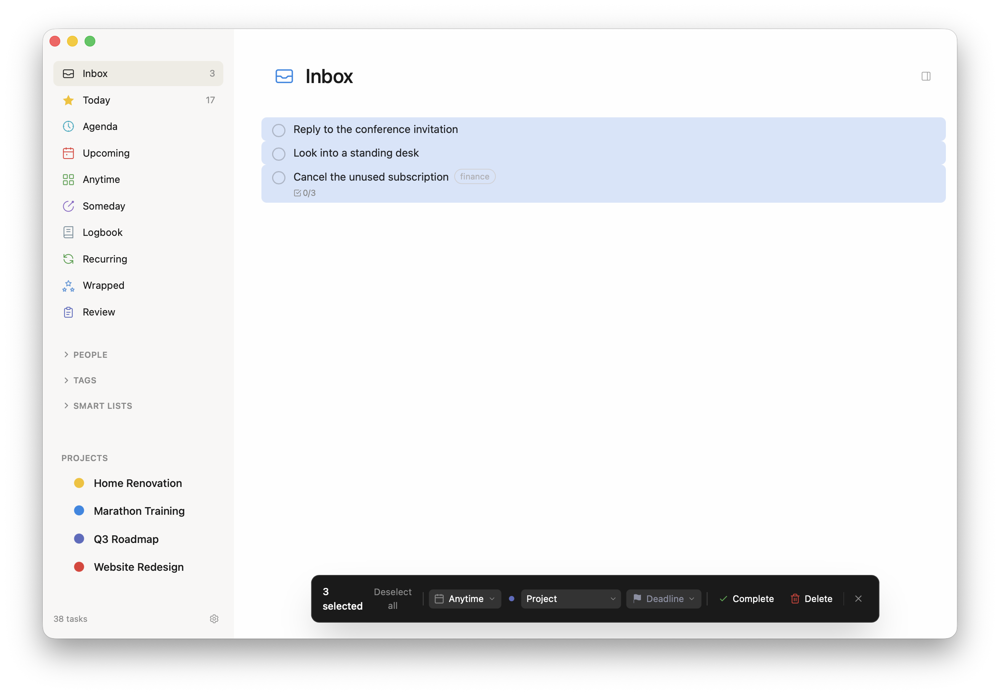
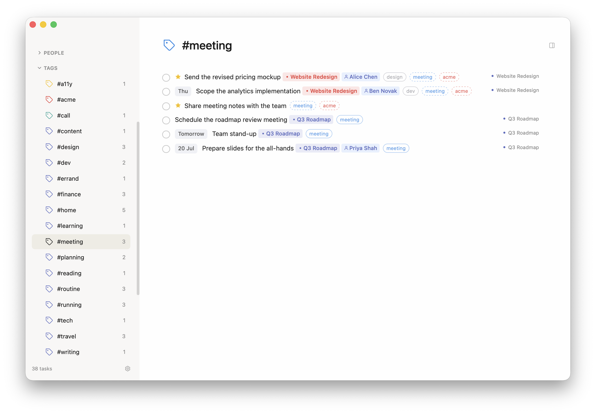
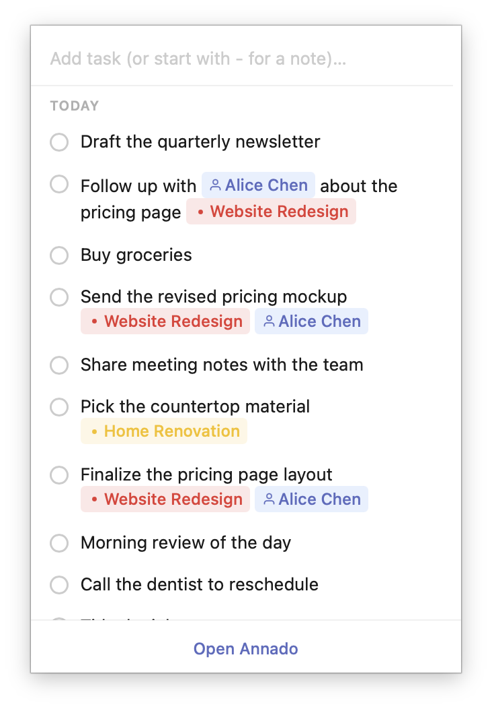
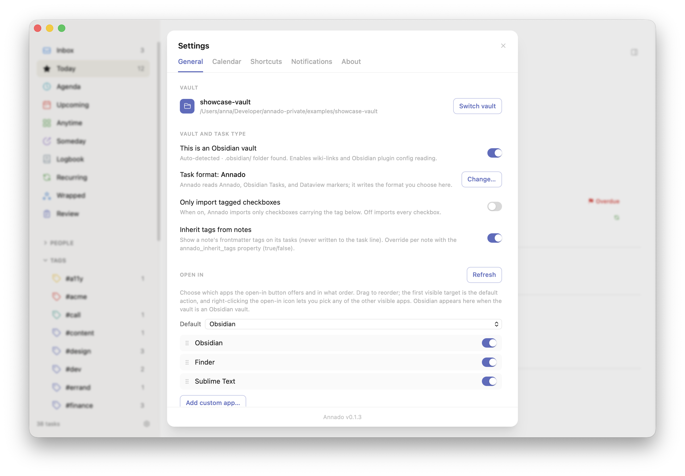

# Annado — Visual Tour

Every screenshot in one place, grouped by what you'd use it for. See the [README](../README.md) for the full feature documentation.

## The workflow in 90 seconds

Capture a task in an Obsidian daily note during a meeting, then edit it in Annado — side by side:

https://github.com/user-attachments/assets/343a7135-a676-4ebd-99f5-dae0626fe181

## Views

The Today view — your daily working list, grouped by project, with an Evening section and deadline flags:

The Inbox holds unscheduled captures until you process them:

Anytime collects flexible tasks you can pick up whenever:

Someday is the pressure-free backlog:

Upcoming lays out the days ahead, with calendar events inline:

Everything in dark mode too:

The Logbook keeps your completed history, grouped by day:

## Plain text underneath

The same task in Annado and in the raw markdown file:

The annotation syntax in a plain editor — `@when`, `@due`, `!(priority)`, checklists:

An expanded task with notes and a toggleable checklist:

## Capture & dates

Quick Add with scheduling, deadline, project, priority, duration, and checklist controls:

Type a date phrase in the title and Annado offers to schedule it:

Write "deadline tomorrow" — or "before tomorrow" — and it becomes a deadline suggestion instead:

Spelled-out offsets work too — "in three weeks" parses just like "in 3 weeks":

The date picker takes natural language in English and Dutch, with quick-select chips:

Quick Find searches tasks, projects, people, views, and tags as you type:

## Organize

Color-coded projects in the sidebar:

A project page with its description and tasks:

Project metadata in action — milestones with dates, deadline, linked people:

Dark mode project page:

Smart Lists combine filters — priority, deadline window, project, person, tag, age:

Recurring tasks repeat on a fixed interval or after completion (a `@repeat` rule on the task, no separate template files):

Multi-select tasks (⇧-click for a range, ⌘A for all) and act on them at once — including an undoable bulk delete:

People are first-class — the sidebar lists contacts with task counts:

A person page shows their metadata and every linked task:

Tags with counts; click to filter. Tags inherited from a note's frontmatter show a dashed border:

## Plan

The Agenda day view with the current-time line and your work schedule:

The week view: drag tasks into slots, resize to set duration, calendar events and breaks block auto-scheduling:

A second view in the side panel, with drag-and-drop between the two:

The menu bar panel keeps today's list one click away — add a task, or start with `-` to log a plain note to the daily note:

## Reflect

The guided Weekly Review — process the inbox card by card with number-key actions:

Wrapped sums up your week, month, or year in animated slides:

## Settings

General: vault, the Open In openers, tag inheritance & import marker, theme, and accent color:

Calendar: per-calendar blocking, work schedule, and breaks that drive auto-scheduling:

Shortcuts: every binding visible, customisable ones remappable:

Notifications: deadline reminders with per-type times, menu bar icon, launch banner:

